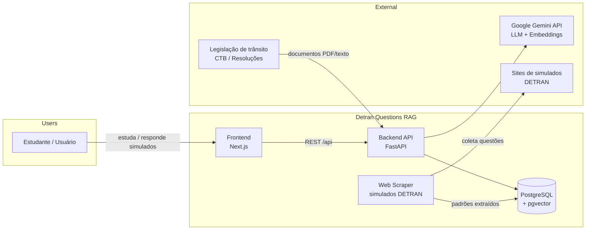
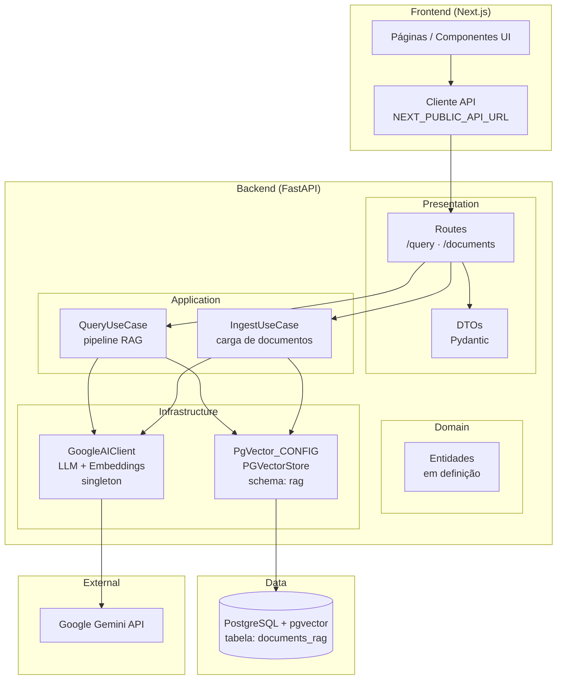
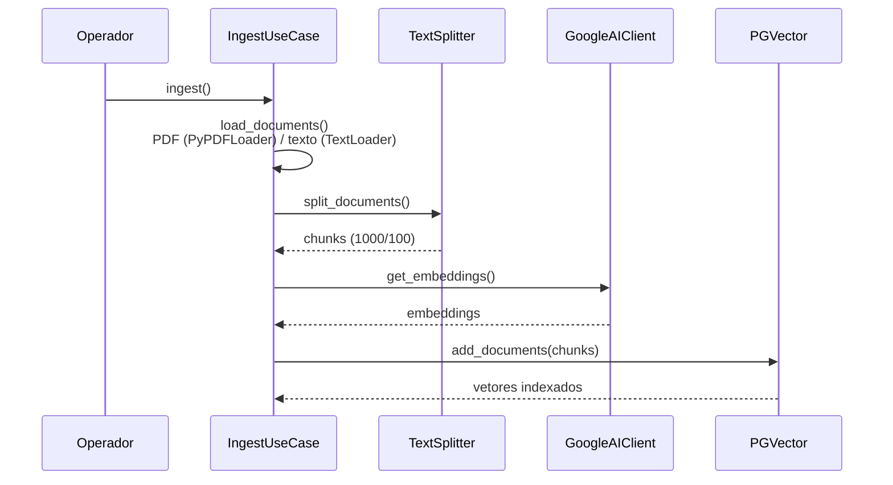
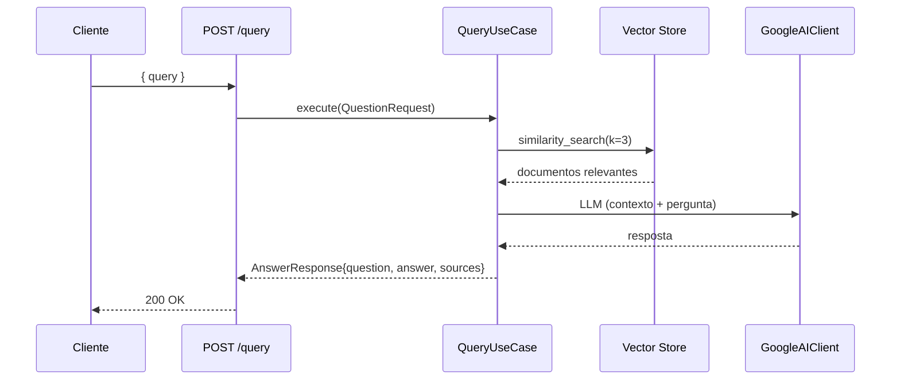
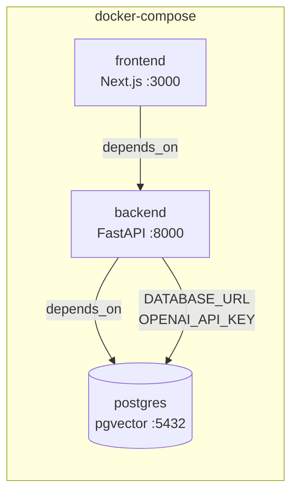

# Architecture — Detran Questions RAG

## 1. Visão Geral

Sistema de Retrieval-Augmented Generation (RAG) para auxiliar estudantes na prova teórica do DETRAN. O sistema:

1. Realiza **web scraping** de simulados do DETRAN para capturar o padrão de questões (estrutura textual, estilo, nomenclatura).
2. Monta uma **base vetorial** a partir do Código de Trânsito Brasileiro (CTB) e legislação correlata.
3. Gera **novas questões** no mesmo padrão do DETRAN, classificadas por **dificuldade** (fácil, médio, difícil) e categoria, usando a base vetorial como fonte de conhecimento (RAG).

### Stack

| Camada | Tecnologia |
| --- | --- |
| Frontend | Next.js 16+, TypeScript |
| Backend | Python 3.12, FastAPI, LangChain / LangGraph |
| LLM | Google Gemini (`gemini-2.0-flash`) |
| Embeddings | Google Gemini (`gemini-embedding-2-preview`) |
| Vector Store | PostgreSQL + pgvector (extensão) |
| Infra | Docker, docker-compose |

---

## 2. Diagrama de Contexto



---

## 3. Diagrama de Componentes



---

## 4. Arquitetura do Backend (Clean Architecture)

O backend segue os princípios de Clean Architecture / Hexagonal, com dependências apontando das camadas externas para as internas.

```
backend/src/
├── main.py                        # Bootstrap da aplicação FastAPI (CORS, rotas, /api)
├── presentation/
│   └── api/routes/
│       ├── routes.py              # Fábrica central de rotas (injeção de use cases)
│       ├── query.py               # POST /query — endpoint RAG
│       └── documents.py           # Rotas de documentos (pendente)
├── application/
│   ├── use_cases/
│   │   ├── query.py               # QueryUseCase — orquestra o pipeline RAG
│   │   └── ingest.py              # IngestUseCase — load, split, embed, indexar
│   └── dtos/
│       ├── query_dto.py           # QuestionRequest, DocumentSource, AnswerResponse
│       └── document_dto.py        # (pendente)
├── domain/
│   └── entities/                  # Entidades de domínio (pendente)
└── infraestructure/               # (sic — mantido o nome atual do projeto)
    ├── clients/
    │   └── google_ai_client.py    # GoogleAIClient — fábrica singleton Gemini
    └── database/
        └── pg_vector.py           # PgVector_CONFIG — conexão/vector store
```

### Responsabilidades por camada

| Camada | Responsabilidade | Exemplos |
| --- | --- | --- |
| `presentation` | Transporte HTTP, validação de entrada, mapeamento DTO ↔ use case | `routes/query.py` |
| `application` | Casos de uso e DTOs; orquestra domínio e infraestrutura | `QueryUseCase`, `IngestUseCase` |
| `domain` | Regras de negócio puras, entidades (em evolução) | `entities/` |
| `infraestructure` | Adaptadores externos: clientes de IA, banco, loaders | `GoogleAIClient`, `PgVector_CONFIG` |

### Decisões relevantes

- **Injeção via fábrica**: `create_api_router()` instancia os use cases e injeta nas rotas (`routes.py`), facilitando testes e desacoplamento.
- **Singleton de clientes IA**: `GoogleAIClient` usa `ClassVar` + `classmethod` para reutilizar uma única instância de LLM e embeddings por processo (`google_ai_client.py`), evitando recriação custosa.
- **Protocols para isolamento**: `EmbeddingsProtocol` e `LLMProtocol` (tipagem estrutural) desacoplam a aplicação das implementações concretas de LangChain.
- **Vector store centralizado**: `PgVector_CONFIG` inicializa o `PGVectorStore` no schema `rag`, tabela `documents_rag` (`pg_vector.py`).

---

## 5. Modelos de IA

| Papel | Modelo | Parâmetros |
| --- | --- | --- |
| Geração (LLM) | `gemini-2.0-flash` | `temperature=0.1` |
| Embeddings | `gemini-embedding-2-preview` | — |

Chave via variável de ambiente `GOOGLE_API_KEY` (carregada do `.env` do projeto).

---

## 6. Armazenamento Vetorial

- **Banco**: PostgreSQL 16 com extensão `pgvector` (imagem `pgvector/pgvector:pg16`).
- **Estrutura**: schema `rag`, tabela `documents_rag`, collection `documents`.
- **Conexão**: `DATABASE_URL_POSTGRES` (fallback local em dev).
- **Chunking**: `RecursiveCharacterTextSplitter` com `chunk_size=1000`, `chunk_overlap=100`.
- **Busca**: similaridade (`search_type="similarity"`) com `k=3` documentos.

---

## 7. Fluxos Principais

### 7.1 Ingestão e Indexação (base de conhecimento)



### 7.2 Consulta RAG (pergunta → resposta com fontes)



### 7.3 Web Scraping e Geração de Questões (planejado)

Pipeline ainda não implementado no código; é o objetivo final do projeto:

1. **Scraper** coleta simulados do DETRAN e extrai padrões (estrutura, estilo, alternativas).
2. Padrões são persistidos na base vetorial com metadados de **dificuldade** e **categoria**.
3. **Gerador** usa RAG (CTB + padrões) para criar novas questões no mesmo estilo.
4. Questões geradas alimentam simulados exibidos no frontend.

---

## 8. API

### Endpoints atuais

| Método | Rota | Descrição |
| --- | --- | --- |
| `POST` | `/api/query/` | Responde pergunta via RAG; retorna `AnswerResponse` com `sources` |

### DTOs principais (`application/dtos/query_dto.py`)

- **`QuestionRequest`** — `query: str` (1–1000 caracteres).
- **`AnswerResponse`** — `question`, `answer`, `sources: List[DocumentSource]`.
- **`DocumentSource`** — `content`, `source` (metadado do documento).

### Próximos endpoints (planejados)

- `POST /api/documents/` — upload de documentos para ingestão (rota `documents.py` pendente).
- `GET /api/simulados/` — listar/gerar simulados.
- `POST /api/questions/generate` — geração de questões por dificuldade/categoria.

---

## 9. Infraestrutura (docker-compose)



- **postgres**: imagem `pgvector/pgvector:pg16`, banco `rag_db`, volume persistente `postgres_data`.
- **backend**: build `./backend`, porta 8000, volume `uploads` + código montado.
- **frontend**: build `./frontend`, porta 3000, `NEXT_PUBLIC_API_URL=http://backend:8000`.

---

## 10. Variáveis de Ambiente

| Variável | Uso | Onde |
| --- | --- | --- |
| `GOOGLE_API_KEY` | Autenticação Gemini (LLM + embeddings) | backend (`.env`) |
| `DATABASE_URL_POSTGRES` | Conexão do vector store | backend |
| `CORS_ORIGINS` | Origens permitidas (default `http://localhost:3000`) | backend |
| `NEXT_PUBLIC_API_URL` | URL da API no frontend | frontend |
| `OPENAI_API_KEY` | Definida no compose (reservada p/ modelos OpenAI) | compose |

---

## 11. Dívidas Técnicas e Evolução

- **`IngestUseCase`**: `DATA_PATH` é variável local (`ingest.py`); documentos carregados mas ingestão não exposta via API.
- **`QueryUseCase`**: `qa_chain` comentado — fluxo de prompt/contexto do LLM ainda precisa ser finalizado (`query.py`).
- **`documents.py`**: rota vazia; registrar no `routes.py`.
- **`domain/`**: camada de entidades ainda vazia — definir modelo de domínio (Questão, Simulado, Categoria, Dificuldade).
- **Padronização**: decidir entre `langchain_postgres.PGVectorStore` (usado em `query.py`/`pg_vector.py`) e `langchain_community.vectorstores.PGVector` (usado em `ingest.py`).
- **Web scraper e gerador de questões**: componentes planejados, ainda não iniciados.
